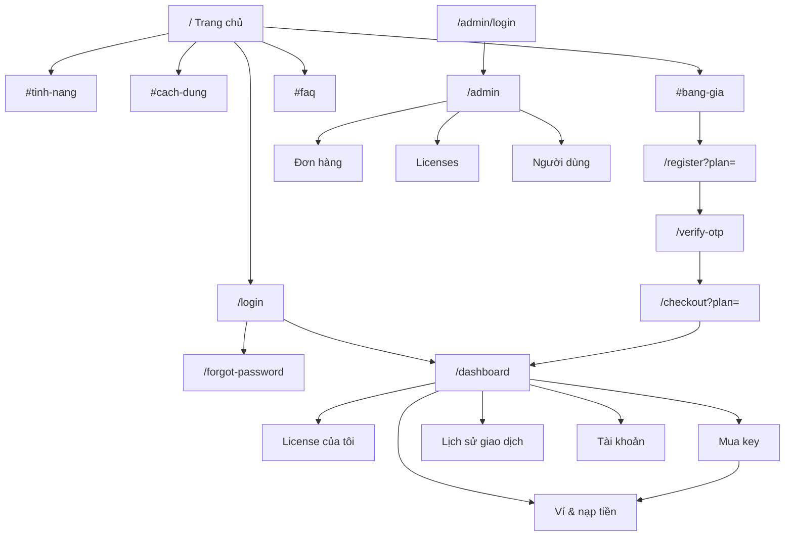

# UI/UX REDESIGN MASTER PLAN — Fairy House AutoData

> Trạng thái: **ĐÃ DUYỆT ✅** · Bắt đầu triển khai.
> Workflow theo skill `ui-ux` (evondevKit), nhánh U: **Audit → Brief (U1) → Việc chính từng màn (U2, cổng 1) → Wireframe 2–3 hướng (U3, cổng 2) → Dựng + probe (U4) → Review → Tinh chỉnh.**
> File này = Audit + U1 + U2 + design system đề xuất + kế hoạch triển khai.
> **Duyệt ngày 2026-10-03.** Quyết định ghi ở mục 21.

---

## 0. Tóm tắt nhanh (đọc phần này trước)

**Audit:** Next.js 14.2 App Router · React 18 · TypeScript · Tailwind 3.4 (token `fha-*` → CSS var trong `src/styles/tokens.css`) · không dùng shadcn/radix/thư viện bảng/biểu đồ · Firebase Admin (Firestore) · PayOS · Nodemailer · JWT cookie (`fh_user_token`, `fh_admin_token`).
- 18 route trang (5 public/auth phụ, 6 customer, 1 checkout, 5 admin, 1 trang mồ côi `/activate`) + 26 API route.
- 14 component UI dùng chung (3 cái chưa dùng: `Pagination`, `Tabs`, `Spinner`), 8 component feature, 6 component layout.
- Style đếm được: glass/backdrop-blur ở **16 file**, gradient ở **10 file**, shadow neumorphism (inset/outset) trên toàn bộ form auth, radius trải từ 8px → 40px, `rounded-full` cho nav item, 3 hệ màu lẫn lộn (cyan `fha-*`, slate/violet hard-code ở checkout & admin login, amber ở admin).
- Hiện có **2 “ngôn ngữ thiết kế” khác nhau**: (a) token `fha-*` dark + glass + neumorphism, (b) Tailwind thô `slate-950/violet/cyan` + aurora blur ở `/checkout` và `/admin/login`.

**Hướng đề xuất (chờ bạn duyệt):** “**Hairline / Sổ cái**” — nền sáng, phẳng, viền mảnh 1px, phân cấp bằng cỡ chữ & độ đậm thay vì bóng/gradient; một màu thương hiệu teal đậm (kế thừa cyan của logo) dùng tiết chế; chữ Be Vietnam Pro + JetBrains Mono cho key/mã giao dịch; admin cùng token nhưng mật độ cao (hướng C — data dense).

**Cần bạn quyết định** → xem [mục 21](#21-câu-hỏi--quyết-định-cần-bạn-duyệt).

---

## 1. Tổng quan website hiện tại

**Sản phẩm:** Chrome Extension **Fairy House AutoData (V2.0)** — quét data khách hàng trên Facebook, tự động kết bạn theo UID; dùng **license key** để kích hoạt; quota scan theo ngày, reset 00:00 giờ VN.

**Website làm 4 việc:**
1. Giới thiệu & bán (landing `/`).
2. Tài khoản (đăng ký + OTP Gmail, đăng nhập, quên mật khẩu bằng OTP).
3. Khu khách hàng: ví (nạp qua PayOS), mua key bằng ví (cấp key tức thì), xem license, lịch sử, đổi mật khẩu.
4. Admin: thống kê, duyệt/từ chối đơn chuyển khoản thủ công, quản lý user (xoá, dọn acc rác).

**Hai luồng mua song song (đều có thật trong code):**

| Luồng | Đường đi | API | Kết quả |
|---|---|---|---|
| A. Mua bằng ví (tự động) | Ví → nạp PayOS (QR, poll 3s) → Store → xác nhận | `payos/create-payment-link`, `payos/check-order`, webhook cộng ví, `orders/pay-with-wallet` | Key cấp ngay + email, order `PAID`, `payment_method: WALLET` |
| B. Chuyển khoản thủ công (chờ duyệt) | Landing pricing → `/register?plan=` → OTP → `/checkout?plan=` → QR VietQR tĩnh (MB Bank) → gửi biên lai Zalo | `orders/submit` → admin `orders/[id]/approve|reject` | Order `PENDING_PAYMENT_REVIEW` → admin duyệt → license `ACTIVE`, order `PAID` / `REJECTED` |
| Trial | Checkout chọn trial **hoặc** Store mua trial | `orders/submit` hoặc `pay-with-wallet` | License trial 3 ngày, `trial_used = true`, 1 lần/tài khoản |

**Gói (nguồn thật: Firestore `plans`, seed từ `src/lib/key-generator.ts`):**

| id | Tên | Giá | Thời hạn | Scan/ngày | Badge |
|---|---|---|---|---|---|
| trial | Dùng Thử | 0đ | 3 ngày | 100 | — |
| monthly | 1 Tháng | 69.000đ | 30 ngày | 1.000 | — |
| quarterly | 3 Tháng | 179.000đ | 90 ngày | 3.000 | PHỔ BIẾN |
| yearly | 1 Năm | 479.000đ | 365 ngày | Không giới hạn | TIẾT KIỆM |

**Key:** format mới `FHAD-XXXX-XXXX-XXXX-XXXX` (còn chấp nhận format cũ `ZT-*`, `FH-*`). Extension xác thực qua `/api/verify-key` (header `x-fh-secret`, có machine binding `maxMachines` mặc định 1), `/api/license/validate`, `/api/license/scan`.

**Kích hoạt (theo nội dung `/activate`):** Mở extension trên Chrome → tab “License Key” → dán key → bấm “Kích hoạt”.

---

## 2. Danh sách toàn bộ route

### 2.1 Route trang (UI)

| # | Route | File | Bảo vệ | Layout |
|---|---|---|---|---|
| 1 | `/` | `src/app/page.tsx` (server) | public | Navbar + footer riêng trong page |
| 2 | `/login` | `src/app/login/page.tsx` | redirect nếu đã login | Auth card |
| 3 | `/register` | `src/app/register/page.tsx` | redirect nếu đã login | Auth card |
| 4 | `/verify-otp` | `src/app/verify-otp/page.tsx` | public (cần `?email=`) | Auth card |
| 5 | `/forgot-password` | `src/app/forgot-password/page.tsx` | public | Auth card, 3 bước trong 1 trang |
| 6 | `/activate` | `src/app/activate/page.tsx` | public | Auth card — **không có link nào trỏ tới (trang mồ côi)** |
| 7 | `/checkout` | `src/app/checkout/page.tsx` | user | Trang đứng riêng, style slate/violet riêng |
| 8 | `/dashboard` | `src/app/dashboard/page.tsx` | user | `AppLayout` (Sidebar + BottomNav) |
| 9 | `/dashboard/wallet` | `.../wallet/page.tsx` | user | AppLayout |
| 10 | `/dashboard/store` | `.../store/page.tsx` | user | AppLayout |
| 11 | `/dashboard/licenses` | `.../licenses/page.tsx` | user | AppLayout |
| 12 | `/dashboard/transactions` | `.../transactions/page.tsx` | user | AppLayout |
| 13 | `/dashboard/settings` | `.../settings/page.tsx` | user | AppLayout |
| 14 | `/admin/login` | `src/app/admin/login/page.tsx` | public | Trang riêng (gradient + glass) |
| 15 | `/admin` | `src/app/admin/page.tsx` | admin | `admin/layout.tsx` + AdminSidebar |
| 16 | `/admin/orders` | `.../orders/page.tsx` | admin | AdminLayout |
| 17 | `/admin/licenses` | `.../licenses/page.tsx` | admin | AdminLayout — **placeholder, không gọi API** |
| 18 | `/admin/users` | `.../users/page.tsx` | admin | AdminLayout |
| — | `/terms`, `/privacy` | **không tồn tại** | — | Footer đang link tới → 404 |

### 2.2 API route (KHÔNG đổi — chỉ để UI tham chiếu)

- **auth:** `login` (POST, DELETE), `logout`, `register`, `verify-otp`, `resend-otp`, `forgot-password`, `reset-password`
- **user:** `dashboard` (GET user + licenses ACTIVE/SUSPENDED + orders), `change-password`
- **plans:** GET (Firestore, tự seed nếu rỗng)
- **orders:** `submit` (trial / đơn chuyển khoản), `pay-with-wallet`
- **payos:** `create-payment-link`, `check-order`, `webhook`
- **license:** `scan`, `validate` · **verify-key** (extension)
- **admin:** `login` (POST, DELETE), `dashboard`, `orders/[id]/approve`, `orders/[id]/reject`, `users` (GET), `users/[id]` (DELETE), `cleanup-users`, `migrate-users`

---

## 3. Danh sách page (nhóm theo khu vực)

- **Public (1):** Trang chủ (hero, số liệu, 6 tính năng, 4 bước, bảng giá, FAQ, CTA, footer).
- **Auth (5):** Đăng nhập, Đăng ký, Xác thực OTP, Quên mật khẩu (3 bước), Đã gửi đơn (`/activate`).
- **Mua hàng (1):** Checkout (chọn gói → thông tin chuyển khoản).
- **Customer (6):** Tổng quan, Ví & nạp tiền, Mua key, License của tôi, Lịch sử giao dịch, Tài khoản & bảo mật.
- **Admin (5):** Đăng nhập admin, Tổng quan, Đơn hàng, Licenses, Người dùng.
- **Thiếu nhưng đang được tham chiếu:** Điều khoản, Chính sách bảo mật.

---

## 4. Phân tích UI hiện tại

| Hạng mục | Hiện trạng | Đánh giá |
|---|---|---|
| Nền & màu | Dark navy `#0a0f1a`, cyan `#00b4d8`, tím gradient ở hero/footer/checkout, amber ở admin, đỏ/vàng/xanh hard-code | 3–4 màu nhấn cạnh tranh nhau, cảm giác “template AI/crypto” |
| Hiệu ứng | Glass (`backdrop-blur`) 16 file, aurora orb blur ở checkout, glow shadow cyan/amber/blue, neumorphism inset cho input | Đúng các thứ bạn muốn tránh; giảm độ tin cậy cho trang thanh toán |
| Radius | 8 / 12 / 16 / 24 / 32 / 40px + `rounded-full` cho nav, nút | Không có thang thống nhất |
| Typography | Inter load 2 lần (next/font + `@import` Google trong `globals.css`); heading `font-black/extrabold`, label 11px uppercase tracking rộng khắp nơi | Phân cấp dựa vào màu & glow thay vì cỡ chữ; chữ 11–12px quá nhiều |
| Icon | SVG inline copy-paste (Heroicons outline) + emoji (✅ 📱 🔐 💡 ♾️) | Lẫn lộn, emoji làm giảm cảm giác chuyên nghiệp |
| Token | Thiếu `fha-success-bg`, `fha-success-border`, `drop-shadow-fha-cyan` trong tailwind config nhưng vẫn được dùng → class chết | Nợ kỹ thuật |
| Component | Có bộ UI kit nhưng checkout, admin login, settings, input mật khẩu tự viết lại style | Không nhất quán |
| Table | `w-[${col.width}]` dựng động → Tailwind JIT không sinh class; không có chế độ mobile | Lỗi hiển thị cột, tràn ngang trên mobile |
| Logo | `public/logo.png` 1.5MB, tròn, dùng kèm glow | Nặng, ảnh hưởng LCP |
| Hero | “Browser mockup” dựng bằng CSS, không phải ảnh thật của extension | Không cho khách thấy sản phẩm thật |

---

## 5. Phân tích UX hiện tại

**Điểm tốt nên giữ:** luồng `?plan=` xuyên suốt register → OTP → checkout; OTP có đếm ngược gửi lại + nhắc kiểm tra Spam; nạp ví có QR + tự poll trạng thái; mua bằng ví có modal xác nhận; admin có ConfirmModal cho thao tác nguy hiểm; toast thống nhất ở khu customer.

**Vấn đề UX:**
1. **Hai luồng mua gây rối:** khách từ landing đi vào checkout chuyển khoản thủ công (chờ duyệt, gửi biên lai Zalo), trong khi trong dashboard có luồng ví tự động cấp key ngay. Khách không được giải thích sự khác nhau.
2. **Thông điệp mâu thuẫn:** FAQ nói “tự động duyệt trong vài giây… kích hoạt ngay”; checkout nói “gửi biên lai qua Zalo để được duyệt”; `/activate` nói “trong vòng 24 giờ”.
3. **Dashboard không trả lời câu “key của tôi đâu, còn bao lâu, còn bao nhiêu lượt”** — chỉ có 3 số liệu chung + 3 đơn gần nhất.
4. **Mua xong không thấy key:** API trả `licenseKey` nhưng Store chỉ toast “đã gửi vào email”.
5. **Ví không có lịch sử nạp** ngay trong trang; PayOS `returnUrl ?success=true|false` không được đọc để báo kết quả.
6. **Trạng thái hiển thị mã thô:** `PENDING_PAYMENT_REVIEW`, `SUSPENDED`, `REJECTED` hiện tiếng Anh/mã hệ thống; `plan_id` hiện `monthly`, `quarterly` thay vì “1 Tháng”, “3 Tháng”.
7. **Lỗi mạng = bị đăng xuất:** dashboard gặp bất kỳ lỗi fetch nào là gọi logout và đẩy về `/login`.
8. **`alert()` / `confirm()`** của trình duyệt ở checkout (copy), ví (validate), admin users (dọn acc rác).
9. **Không có hướng dẫn cài đặt / kích hoạt** ở khu khách hàng; hướng dẫn chỉ nằm ở trang mồ côi `/activate`.
10. **Admin không dùng được trên mobile** (sidebar `hidden md:flex`, không có nav thay thế).
11. **Admin Đơn hàng chỉ thấy 20 đơn gần nhất**, cột “Khách hàng” luôn `N/A` (order không lưu email); **Admin Licenses là placeholder**.
12. **BottomNav lẫn EN/VI** (“Home”, “Store”, “Key” cạnh “Ví”, “Tài khoản”).
13. **Footer link 404** (`/terms`, `/privacy`).
14. **Số liệu tin cậy chưa kiểm chứng** trên landing: “1,000+ người dùng”, “99.9% uptime”.
15. Danh sách đơn của user không sắp xếp (Firestore trả không theo thứ tự).

---

## 6. Những vấn đề cần sửa (gom theo mức độ)

### 6.1 Sửa được ở lớp giao diện (nằm trong phạm vi redesign)
- Thống nhất 1 design system, bỏ glass/gradient/glow/neumorphism/aurora, bỏ emoji trong UI.
- Map trạng thái & tên gói sang tiếng Việt (bảng map ở client, đọc tên gói từ `/api/plans`).
- Hiện key ngay sau khi mua bằng ví (dùng `licenseKey` API đã trả).
- Đọc `?success=` trên trang ví để hiện banner kết quả.
- Sắp xếp đơn/giao dịch phía client theo `created_at` giảm dần.
- Thay `alert/confirm` bằng Toast/ConfirmModal có sẵn.
- Admin có nav mobile; bảng có chế độ thẻ/scroll có sticky cột đầu trên mobile.
- Sửa class động trong `Table`, bổ sung token còn thiếu, bỏ load font trùng.
- Thống nhất copy về luồng thanh toán (sau khi bạn xác nhận nội dung đúng).

### 6.2 Cần đổi logic/backend → **KHÔNG tự làm, chờ bạn quyết** (chi tiết mục 17.3)

---

## 7. Design direction đề xuất

### 7.1 Brief (U1)

| | |
|---|---|
| **Sản phẩm** | Bán license key cho Chrome Extension quét data Facebook / kết bạn theo UID |
| **Người dùng chính** | Người bán hàng online, sale, chủ shop nhỏ ở VN; dùng điện thoại nhiều; không rành kỹ thuật; quan tâm “có hoạt động không, giá bao nhiêu, mua xong dùng ngay được không” |
| **Người dùng phụ** | Admin (chủ sản phẩm) — duyệt đơn, xử lý user, xem số liệu; chủ yếu desktop, đôi khi điện thoại |
| **Cảm giác cần đạt** | Đáng tin như một công cụ làm việc nghiêm túc — rõ ràng, gọn, minh bạch về giá và thanh toán |
| **Tránh** | Crypto/AI look, glow, gradient tím-xanh, glass, card lồng card, góc bo quá tròn, animation thừa |
| **Ngôn ngữ** | Tiếng Việt toàn bộ (kể cả nav, trạng thái, nút) |
| **Brand giữ lại** | Logo tròn Fairy House + màu cyan/teal làm màu nhận diện |

### 7.2 Ba hướng hình ảnh (sẽ vẽ thành wireframe ở U3, bạn chọn 1)

| Hướng | Mô tả | Hợp với |
|---|---|---|
| **A. Hairline sáng (đề xuất)** | Nền xám rất nhạt, bề mặt trắng, viền 1px, không bóng; teal đậm cho CTA; phân cấp bằng typography; key & mã GD dùng mono | Thương mại, tin cậy, dễ đọc trên mobile ngoài trời |
| B. Hairline sáng + dải tối | Như A, nhưng hero & CTA cuối landing dùng 1 dải nền tối đặc (không gradient) để tạo điểm nhấn thương hiệu | Nếu bạn muốn giữ chút “chất” tối của bản cũ ở trang public |
| C. Tối tiết chế | Giữ nền tối nhưng phẳng: bỏ glass/glow/gradient, viền mảnh, 1 màu nhấn | Nếu bạn nhất định giữ dark mode làm mặc định |

Admin dùng chung token của hướng được chọn nhưng ở **mật độ cao** (hàng bảng 40px, chữ 13px, filter bar cố định).

### 7.3 Nguyên tắc
1. Một màu nhấn, dùng cho hành động chính & trạng thái chọn — không dùng làm trang trí.
2. Phân cấp: cỡ chữ → độ đậm → màu xám; không dùng glow/shadow để phân cấp.
3. Bóng chỉ cho lớp nổi (modal, dropdown, toast).
4. Card chỉ khi nhóm nội dung thật sự độc lập; trong card dùng đường kẻ, không lồng card.
5. Số tiền, key, mã giao dịch: mono/tabular-nums, có nút sao chép.
6. Mỗi màn có **một** CTA chính rõ ràng.
7. Motion: chỉ transition 150–200ms cho hover/focus/mở-đóng; tôn trọng `prefers-reduced-motion`.

---

## 8. Design system đề xuất

> Token viết dưới dạng CSS var trong `src/styles/tokens.css` và map vào `tailwind.config.js` (giữ tiền tố `fha-` để không vỡ import, đổi giá trị + chuẩn hoá tên). Giá trị cuối cùng chốt sau khi bạn chọn hướng ở U3.

### 8.1 Typography
- **Sans:** Be Vietnam Pro (thiết kế cho dấu tiếng Việt) — 400/500/600/700. Phương án dự phòng: giữ Inter.
- **Mono:** JetBrains Mono — key, mã giao dịch, số tài khoản.
- Load **một lần** qua `next/font` (bỏ `@import` trong `globals.css`).
- Số liệu & tiền: `font-variant-numeric: tabular-nums`.

### 8.2 Font scale

| Token | px / line-height | Dùng cho |
|---|---|---|
| `text-xs` | 12 / 16 | Chú thích, meta bảng |
| `text-sm` | 13 / 20 | Bảng admin, label, nút nhỏ |
| `text-base` | 14 / 22 | Nội dung app mặc định |
| `text-md` | 16 / 24 | Nội dung landing, input mobile (tránh zoom iOS) |
| `text-lg` | 18 / 28 | Tiêu đề card/section nhỏ |
| `text-xl` | 20 / 28 | Tiêu đề trang app |
| `text-2xl` | 24 / 32 | Số liệu KPI, tiêu đề auth |
| `text-3xl` | 30 / 38 | H2 landing |
| `text-4xl` | 36 / 44 | H1 landing mobile |
| `text-5xl` | 48 / 56 | H1 landing desktop |

Weight: 400 nội dung · 500 label/nav · 600 tiêu đề/nút · 700 chỉ cho H1 và số tiền lớn. Bỏ `font-black/extrabold`. Hạn chế UPPERCASE (chỉ eyebrow nhỏ trên landing).

### 8.3 Color system (hướng A — đề xuất)

| Vai trò | Token | Giá trị | Ghi chú |
|---|---|---|---|
| Nền trang | `--bg` | `#F6F7F9` | |
| Bề mặt | `--surface` | `#FFFFFF` | card, bảng, modal |
| Bề mặt phụ | `--surface-2` | `#F1F3F5` | header bảng, hover hàng |
| Viền | `--border` | `#E3E6EA` | 1px mọi nơi |
| Viền mạnh | `--border-strong` | `#CDD2D8` | input, focus ranh giới |
| Chữ chính | `--text` | `#111827` | |
| Chữ phụ | `--text-muted` | `#4B5563` | ≥ 4.5:1 trên trắng |
| Chữ mờ | `--text-faint` | `#6B7280` | placeholder, meta |
| **Brand** | `--brand` | `#0E7490` | teal đậm (kế thừa cyan), nút chính, link — AA trên trắng |
| Brand hover | `--brand-hover` | `#155E75` | |
| Brand nhạt | `--brand-soft` | `#ECFEFF` | nền trạng thái chọn |
| Accent logo | `--brand-accent` | `#00B4D8` | chỉ cho chi tiết nhỏ (logo, chấm trạng thái), không dùng cho chữ trên nền trắng |
| Thành công | `--success` / `-soft` | `#067647` / `#ECFDF3` | |
| Cảnh báo | `--warning` / `-soft` | `#B54708` / `#FFFAEB` | chờ duyệt, sắp hết hạn |
| Lỗi | `--danger` / `-soft` | `#B42318` / `#FEF3F2` | |
| Thông tin | `--info` / `-soft` | `#175CD3` / `#EFF8FF` | |

Bỏ: tím/violet, amber admin, mọi gradient, mọi `text-white` hard-code. Mọi màu đi qua token.

### 8.4 Spacing
Thang 4px: `4, 8, 12, 16, 20, 24, 32, 40, 48, 64, 80, 96`.
- Padding card: 20 (mobile 16). Khoảng cách section app: 24. Section landing: 80–96 desktop / 56 mobile.
- Container: landing 1120px; app content 1080px; admin 1280px (bảng có thể full).

### 8.5 Border radius
`--r-sm: 6px` (badge, chip, checkbox) · `--r-md: 8px` (button, input) · `--r-lg: 12px` (card, modal, bảng) · `--r-full` chỉ cho avatar/chấm trạng thái. Bỏ 16–40px và nav `rounded-full`.

### 8.6 Shadow
- Card/bảng: **không bóng**, chỉ viền.
- `--shadow-overlay: 0 8px 24px rgba(17,24,39,.08), 0 2px 6px rgba(17,24,39,.06)` cho modal, dropdown, toast, drawer mobile.
- Focus ring: `0 0 0 3px rgba(14,116,144,.25)`.

### 8.7 Buttons

| Biến thể | Dùng | Style |
|---|---|---|
| Primary | 1 hành động chính/màn | nền brand, chữ trắng |
| Secondary | hành động phụ | nền trắng, viền `border-strong` |
| Ghost | hành động phụ trong bảng/toolbar | không nền, hover `surface-2` |
| Danger | xoá, từ chối | nền danger (trong modal) / chữ danger (trong bảng) |
| Link | điều hướng trong câu | chữ brand, gạch chân khi hover |

Size: sm 32px · md 40px · lg 44px (mobile CTA). Trạng thái: hover, active, focus-visible, disabled, loading (spinner + giữ độ rộng). Icon tuỳ chọn bên trái, 16px.

### 8.8 Inputs & Forms
- Label trên, luôn hiện; dấu `*` cho bắt buộc; hint dưới input; lỗi dưới input màu danger + `aria-describedby`.
- **Không icon trái** (theo skill); icon phải chỉ cho hành động (hiện/ẩn mật khẩu, sao chép).
- Cao 40px (app) / 44px (auth mobile); font 16px trên mobile.
- Một `PasswordInput` dùng chung (thay 3 bản tự viết ở login/register/settings).
- Form 1 cột, max 440px (auth) / 560px (settings).
- Lỗi tổng của form: `Alert` danger phía trên nút submit.
- Amount input (ví): gợi ý nhanh dạng chip 50k/100k/200k/500k, định dạng nghìn khi gõ, validate inline (bỏ `alert`).

### 8.9 Cards
- `Card` 1 biến thể: trắng + viền + r-lg; slot `header` (tiêu đề + action), `body`, `footer` có đường kẻ.
- Bỏ biến thể glass/neumorphism.

### 8.10 Tables
- Header nền `surface-2`, chữ 12px weight 500 (không uppercase rộng).
- Hàng 48px (customer) / 40px (admin, density compact); số tiền canh phải, tabular.
- Hỗ trợ: sort cột (client), cột hành động cố định phải, chọn hàng (nếu cần sau này).
- Mobile: chuyển thành **danh sách thẻ** (mỗi hàng 1 khối dọc: dòng chính + meta + trạng thái) — prop `mobileRender`.
- Trạng thái: loading skeleton, empty, error + nút thử lại.
- Sửa lỗi class động `w-[${width}]` → dùng `style={{width}}`.

### 8.11 Badges (StatusBadge)
Map trạng thái thật trong DB → nhãn Việt + màu:

| Mã | Nhãn | Màu |
|---|---|---|
| `ACTIVE` | Đang hoạt động | success |
| `SUSPENDED` | Tạm khoá | warning |
| `EXPIRED` | Hết hạn | neutral |
| `REVOKED` | Đã thu hồi | neutral |
| `PAID` | Đã thanh toán | success |
| `PENDING_PAYMENT_REVIEW` | Chờ duyệt | warning |
| `PENDING` | Đang chờ | warning |
| `REJECTED` | Bị từ chối | danger |
| `CANCELLED` | Đã huỷ | neutral |
| email_verified true/false (admin users) | Đã xác thực / Chưa xác thực | success / neutral |

Badge: cao 22px, r-sm, nền soft + chữ đậm màu, chấm tròn 6px tuỳ chọn.

### 8.12 Alerts
4 loại info/success/warning/danger; nền soft + viền trái 3px hoặc viền đủ 1px; icon 16px; tiêu đề tuỳ chọn; nút đóng tuỳ chọn. Dùng cho: thông báo spam OTP, lưu ý chuyển khoản, kết quả PayOS, số dư không đủ.

### 8.13 Modal
- Overlay `rgba(17,24,39,.45)` (không blur), panel trắng r-lg, shadow-overlay, max 480px (confirm) / 640px (chi tiết).
- Mobile: thành **bottom sheet** full-width.
- Focus trap, Esc đóng (trừ khi loading), trả focus về nút mở.
- `ConfirmModal` giữ API hiện tại (`open, onClose, title, message, confirmText, onConfirm, loading, danger`).

### 8.14 Dropdown / Menu
Mới (chưa có): dùng cho menu tài khoản trên topbar, menu hành động hàng bảng admin trên mobile, filter trạng thái. Panel trắng, shadow-overlay, item 36px, điều hướng phím.

### 8.15 Tabs
Tận dụng `Tabs.tsx` (đang không dùng): gạch chân 2px brand cho tab active. Dùng cho: Lịch sử (Tất cả / Nạp tiền / Mua key), Admin đơn (Chờ duyệt / Đã thanh toán / Bị từ chối / Tất cả), License (Đang hoạt động / Tạm khoá).

### 8.16 Navigation
- **Public Navbar:** nền trắng đặc + viền dưới, cao 64px; logo · Tính năng · Cách dùng · Bảng giá · FAQ · [Đăng nhập] [Dùng thử miễn phí]. Mobile: nút menu → sheet từ trên xuống, CTA dính đáy sheet.
- **Customer:** sidebar trái 240px (desktop) + topbar mỏng (tiêu đề trang, số dư ví dạng chip, menu tài khoản). Mobile: topbar + BottomNav 5 mục tiếng Việt.
- **Admin:** sidebar 220px nền trắng, nhãn nhỏ “Quản trị”; mobile: topbar + drawer.

### 8.17 Sidebar
Item 36px, r-md, icon 18px + nhãn; active: nền `brand-soft` + chữ brand + vạch trái 2px; nhóm có tiêu đề nhỏ. Cuối sidebar: “Về trang chủ”, “Hỗ trợ Zalo”, “Đăng xuất”.

### 8.18 Toast
Giữ `ToastProvider` API (`toast.success/error/...`). Style: trắng + viền + icon màu + shadow-overlay; góc dưới-phải desktop, trên-giữa mobile; tự đóng 4s, có nút đóng; `role="status"`/`aria-live`.

### 8.19 Loading & Skeleton
- Skeleton theo đúng hình dạng nội dung (KPI, hàng bảng, thẻ license) — nền `surface-2`, shimmer nhẹ hoặc không (tôn trọng reduced-motion).
- Spinner chỉ trong nút và vùng nhỏ. Bỏ “Loading...” tiếng Anh ở Suspense fallback.

### 8.20 Empty / Error / Success states
- **Empty:** icon line 24px trong ô 48px viền, tiêu đề 1 dòng, mô tả 1–2 dòng, 1 CTA (vd. “Chưa có license” → “Mua key”).
- **Error:** thông điệp người đọc được + “Thử lại”; không đăng xuất user vì lỗi mạng (xem 17.3).
- **Success:** màn xác nhận có tiêu đề rõ, tóm tắt (gói, số tiền, mã GD, key), bước tiếp theo, CTA chính. Không dùng emoji/glow.

---

## 9. Information architecture

**Nav khách hàng (sắp lại theo tần suất):**
1. Tổng quan · 2. License của tôi · 3. Mua key · 4. Ví & nạp tiền · 5. Lịch sử giao dịch · 6. Tài khoản
BottomNav mobile: Tổng quan · License · Mua key · Ví · Tài khoản (Lịch sử vào từ Tổng quan/Ví).

**Landing (thứ tự section):** Hero → Vấn đề/giải pháp ngắn → Tính năng (6, có thật) → Cách dùng 4 bước (đăng ký → chọn gói → nhận key → kích hoạt trong extension) → Bảng giá (từ `/api/plans`) → Thanh toán & kích hoạt (giải thích rõ 2 cách thanh toán) → FAQ → CTA cuối → Footer.

**Trang đề xuất thêm (chỉ nội dung tĩnh, cần bạn duyệt + cung cấp nội dung):** `/terms`, `/privacy` (đang 404), tuỳ chọn `/huong-dan` (cài đặt + kích hoạt, có ảnh chụp extension thật).

---

## 10. Danh sách page cần redesign (spec từng màn)

### 10.0 Bảng “việc chính” từng màn (U2 — cổng 1)

| Màn | Việc chính duy nhất | CTA chính |
|---|---|---|
| Trang chủ | Hiểu sản phẩm làm gì & bắt đầu dùng thử / chọn gói | Dùng thử miễn phí |
| Đăng nhập | Vào tài khoản | Đăng nhập |
| Đăng ký | Tạo tài khoản nhanh | Tạo tài khoản |
| Xác thực OTP | Nhập 6 số từ Gmail | Xác thực |
| Quên mật khẩu | Lấy lại quyền truy cập | Gửi mã / Đổi mật khẩu |
| Đã gửi đơn (`/activate`) | Biết đơn đã nhận & bước tiếp theo | Về trang quản lý |
| Checkout | Chọn gói & thanh toán đúng nội dung | Tiếp tục thanh toán |
| Tổng quan | Thấy key đang dùng, hạn, lượt scan, số dư | Sao chép key / Mua key |
| License | Lấy key & theo dõi hạn / quota | Sao chép key |
| Mua key | So gói & mua bằng ví | Mua gói |
| Ví | Nạp tiền nhanh qua QR | Tạo mã QR |
| Lịch sử | Tra một giao dịch | (lọc/tìm) |
| Tài khoản | Đổi mật khẩu | Lưu mật khẩu |
| Admin login | Vào admin | Đăng nhập |
| Admin tổng quan | Biết việc cần xử lý ngay (đơn chờ duyệt) | Xem đơn chờ duyệt |
| Admin đơn hàng | Duyệt / từ chối đơn | Duyệt |
| Admin licenses | Tra cứu key | (tìm) |
| Admin người dùng | Tìm & xử lý user | (tìm) / Dọn acc rác |

---

### 10.1 Trang chủ `/`
- **Mục đích:** Giới thiệu + chuyển đổi (dùng thử / mua).
- **User:** Khách mới (chủ yếu mobile, đến từ Zalo/Facebook), khách cũ quay lại đăng nhập.
- **Layout:** Navbar trắng 64px → Hero 2 cột (trái: H1, mô tả 1–2 câu, 2 CTA, dòng tin cậy nhỏ “Dùng thử 3 ngày · không cần thẻ”; phải: ảnh/khung minh hoạ extension) → dải “vấn đề → giải pháp” 3 cột chữ → Tính năng lưới 3×2 không card (icon + tiêu đề + 2 dòng, chia bằng đường kẻ) → Cách dùng 4 bước ngang (mobile dọc, đánh số) → Bảng giá 4 cột → “Thanh toán & kích hoạt” 2 cột (Ví/PayOS tự động · Chuyển khoản chờ duyệt) → FAQ accordion 1 cột 720px → CTA cuối (dải brand-soft hoặc dải tối đặc nếu hướng B) → Footer 4 cột.
- **Components:** Navbar, Hero, FeatureGrid, StepList, PricingTable/PlanCard, PaymentMethods, FAQAccordion, CTASection, Footer.
- **CTA:** chính “Dùng thử miễn phí” (`/register?plan=trial`); phụ “Xem bảng giá” (#bang-gia); nếu đã login: “Vào trang quản lý”.
- **Data:** cookie đăng nhập (server), `/api/plans` (giá, thời hạn, scan, badge). Nội dung tĩnh: 6 tính năng hiện có, 4 bước, FAQ, Zalo `0378791667`.
- **States:** pricing loading (skeleton 4 cột), pricing lỗi (fallback static hiện có + không báo lỗi to), đã/chưa đăng nhập.
- **Responsive:** Hero 1 cột trên mobile (ảnh xuống dưới, CTA full width); pricing → cuộn ngang snap hoặc xếp dọc với gói “Phổ biến” lên đầu; features 1 cột; nav → sheet.
- **UX improvements:** bỏ số liệu chưa kiểm chứng (hoặc thay bằng dữ kiện thật — chờ bạn); ảnh chụp extension thật thay mockup CSS (cần bạn cung cấp); FAQ sửa cho khớp luồng thanh toán thật; thêm section giải thích 2 cách thanh toán; anchor tiếng Việt; footer bỏ link 404 hoặc tạo trang.

### 10.2 Đăng nhập `/login`
- **Mục đích:** Đăng nhập. **User:** khách đã có tài khoản.
- **Layout:** Auth layout dùng chung: trái (desktop ≥1024) cột thương hiệu hẹp nền `surface-2` với logo + 3 gạch đầu dòng lợi ích; phải form 400px. Mobile: chỉ form, logo trên.
- **Components:** AuthLayout, Input, PasswordInput, Button, Alert, Link.
- **CTA:** “Đăng nhập”; phụ “Quên mật khẩu?”, “Tạo tài khoản”.
- **Data:** POST `/api/auth/login`; giữ `?plan=` → `/checkout?plan=`; `EMAIL_NOT_VERIFIED` → `/verify-otp`.
- **States:** idle, submitting, lỗi sai thông tin (Alert), email chưa xác thực (chuyển trang — giữ nguyên).
- **Responsive:** input 44px, font 16px, nút full width.
- **UX improvements:** bỏ icon trái, bỏ glass/neumorphism; hiện gói đang chọn nếu có `?plan=` (“Bạn đang mua gói 3 Tháng”); autocomplete đúng (`email`, `current-password`).

### 10.3 Đăng ký `/register`
- **Mục đích:** Tạo tài khoản. **User:** khách mới.
- **Layout:** AuthLayout; form: Họ tên, Email, Zalo (tuỳ chọn), Mật khẩu, Xác nhận mật khẩu.
- **Components:** như login + hint độ dài mật khẩu (≥6, đúng rule hiện có).
- **CTA:** “Tạo tài khoản”; phụ “Đã có tài khoản? Đăng nhập”.
- **Data:** POST `/api/auth/register` → `/verify-otp?email=&plan=`.
- **States:** validate inline (mật khẩu không khớp hiện ngay dưới ô), submitting, lỗi server.
- **Responsive:** 1 cột.
- **UX improvements:** ghi rõ “Chúng tôi sẽ gửi mã 6 số tới Gmail của bạn”; đánh dấu Zalo “tuỳ chọn – để hỗ trợ nhanh”; hiện gói đang chọn; `autocomplete="new-password"`.

### 10.4 Xác thực OTP `/verify-otp`
- **Mục đích:** Xác thực email. **User:** vừa đăng ký / login khi chưa xác thực.
- **Layout:** AuthLayout; tiêu đề, email (in đậm, có “Đổi email”), OTPInput 6 ô, Alert spam, nút, gửi lại (đếm ngược 60s).
- **Components:** OTPInput (theo `components/otp-input.md` của skill: auto-advance, paste 6 số, backspace lùi, `inputmode="numeric"`, `autocomplete="one-time-code"`), Alert, Button.
- **CTA:** “Xác thực”.
- **Data:** `/api/auth/verify-otp`, `/api/auth/resend-otp`; thành công → `/checkout?plan=` hoặc `/dashboard` sau 1.5s.
- **States:** nhập, đang xác thực, sai mã, hết hạn/vượt số lần (xoá ô), đã gửi lại, thành công (màn ngắn có check icon).
- **Responsive:** ô OTP 44×52, gap 8, vừa 320px.
- **UX improvements:** tự submit khi đủ 6 số (tuỳ chọn – chờ bạn); bỏ emoji 💡.

### 10.5 Quên mật khẩu `/forgot-password`
- **Mục đích:** Đặt lại mật khẩu bằng OTP. **User:** quên mật khẩu.
- **Layout:** AuthLayout + chỉ báo bước “1 Email · 2 Mã & mật khẩu mới · 3 Xong”.
- **Components:** Stepper nhỏ, Input, OTPInput, PasswordInput, Alert, Button.
- **CTA:** bước 1 “Gửi mã”; bước 2 “Đổi mật khẩu”; bước 3 “Đăng nhập”.
- **Data:** `/api/auth/forgot-password`, `/api/auth/reset-password` (giữ nguyên).
- **States:** như hiện có (3 bước, resend, lỗi, hết hạn).
- **Responsive:** 1 cột.
- **UX improvements:** stepper rõ ràng; giữ email đã nhập khi quay lại bước 1.

### 10.6 Đã gửi đơn `/activate`
- **Mục đích:** Xác nhận đơn đã nhận + hướng dẫn kích hoạt. **User:** khách vừa gửi đơn chuyển khoản.
- **Hiện trạng:** không có link nào trỏ tới. **Đề xuất:** giữ route, dùng lại nội dung thành component `ActivationGuide` (dùng ở Checkout bước cuối, License, Tổng quan). Việc có điều hướng tới `/activate` hay không → chờ bạn.
- **Layout:** AuthLayout; trạng thái đơn, 3 bước kích hoạt, liên hệ Zalo.
- **CTA:** “Về trang quản lý”; phụ “Liên hệ Zalo”.
- **States:** tĩnh.
- **UX improvements:** sửa thông điệp thời gian duyệt cho khớp thực tế (chờ bạn xác nhận “24 giờ” hay khác); bỏ link “Đăng ký thêm tài khoản khác”.

### 10.7 Checkout `/checkout`
- **Mục đích:** Chọn gói và thanh toán chuyển khoản (chờ admin duyệt); trial kích hoạt ngay.
- **User:** khách đi từ landing → đăng ký.
- **Layout:** Header tối giản (logo + “Thanh toán an toàn” + link về dashboard). 2 cột desktop: trái chọn gói (radio card dạng hàng, không scale/glow), phải tóm tắt đơn sticky (gói, thời hạn, scan/ngày, tổng tiền, nút). Bước 2: trái QR (khung trắng đơn giản), phải bảng thông tin chuyển khoản (Ngân hàng, Chủ TK, Số TK, Số tiền, Nội dung CK — mỗi dòng nút “Sao chép”), Alert lưu ý, bước tiếp theo, nút Zalo + về dashboard.
- **Components:** Stepper (Chọn gói → Thanh toán → Chờ duyệt), PlanRadio, OrderSummary, BankTransferPanel, CopyField, Alert, Button, Toast.
- **CTA:** bước 1 “Tiếp tục thanh toán” / trial “Kích hoạt dùng thử”; bước 2 “Tôi đã chuyển khoản – gửi biên lai Zalo”.
- **Data:** POST `/api/orders/submit` (giữ nguyên, trả `transactionCode`, `amount`, idempotent nếu đã có đơn pending). Giá hiển thị: **hiện đang hard-code trong file** — đề xuất đọc từ `/api/plans` (chỉ đọc, không đổi API) để khớp Firestore → chờ bạn duyệt (mục 17.3).
- **States:** chọn gói, đang tạo đơn, lỗi (`TRIAL_ALREADY_USED`, chưa xác thực email, lỗi hệ thống), đã có đơn chờ duyệt (API trả lại đơn cũ → hiện nhãn “Đơn đang chờ duyệt”), đã copy (toast thay `alert`).
- **Responsive:** mobile 1 cột: tóm tắt đơn thành thanh dính đáy (tổng tiền + nút); bước 2: QR trên, thông tin dưới; nút “Mở app ngân hàng” không có (không bịa).
- **UX improvements:** bỏ aurora/gradient/glow; thêm lựa chọn “Bạn có số dư ví? Mua tức thì trong trang Mua key” (chỉ là link, không đổi logic — chờ duyệt); hiển thị rõ “Đơn chuyển khoản cần admin duyệt”.

### 10.8 Tổng quan `/dashboard`
- **Mục đích:** Một nhìn thấy hết: key đang dùng, hạn, quota hôm nay, số dư, việc cần làm.
- **User:** khách đã đăng nhập.
- **Layout:**
  1. Lời chào + chip số dư (topbar).
  2. **Khối “Key đang dùng”** (rộng nhất): key mono + nút Sao chép, gói, ngày hết hạn + “còn N ngày”, thanh quota hôm nay `daily_used/daily_limit`, trạng thái. Nhiều key → hiện key hết hạn gần nhất + “Xem tất cả (n)”.
  3. Hàng 3 số liệu phẳng (không card riêng — 1 dải chia cột): Số dư ví · License đang hoạt động · Đơn chờ duyệt.
  4. 2 cột: “Giao dịch gần đây” (5 dòng) · “Hướng dẫn kích hoạt” (ActivationGuide rút gọn + Zalo).
- **Components:** PageHeader, ActiveLicensePanel, LicenseKey, QuotaBar, StatStrip, MiniTable, ActivationGuide, EmptyState.
- **CTA:** có key → “Sao chép key”; chưa có → “Dùng thử miễn phí / Mua key”; số dư thấp → “Nạp tiền”.
- **Data:** `/api/user/dashboard` (user.full_name, wallet_balance, licenses[license_key, plan_id, status, expires_at, daily_used, daily_limit], orders[]). Tên gói từ `/api/plans`.
- **States:** loading skeleton đúng hình; chưa có license (empty có CTA); có đơn `PENDING_PAYMENT_REVIEW` (Alert “Đơn … đang chờ duyệt”); lỗi tải (ErrorState + Thử lại); license `SUSPENDED` (Alert warning).
- **Responsive:** mobile: khối key lên đầu, stat strip 3 cột nhỏ hoặc cuộn ngang, giao dịch dạng list.
- **UX improvements:** trả lời ngay “key của tôi”, “còn bao lâu”, “còn bao nhiêu lượt”; đơn sắp xếp mới nhất; tên gói tiếng Việt.

### 10.9 Ví & nạp tiền `/dashboard/wallet`
- **Mục đích:** Nạp tiền vào ví qua PayOS.
- **Layout:** 2 cột desktop: trái “Số dư hiện tại” + form nạp (chip mệnh giá, ô số tiền, nút “Tạo mã QR”); phải khu QR (trạng thái chờ/đã nhận/hết hạn, đếm ngược 5:00, thông tin CK có copy). Dưới: “Lịch sử nạp tiền” (lọc `type === 'DEPOSIT'` từ dữ liệu dashboard có sẵn).
- **Components:** BalanceCard, AmountInput + Chip, QRPayment (restyle), CopyField, Alert, Table/List, Toast.
- **CTA:** “Tạo mã QR”.
- **Data:** `/api/user/dashboard`, `/api/payos/create-payment-link`, poll `/api/payos/check-order` (giữ nguyên 3s / 300s).
- **States:** nhập số tiền (validate inline ≥10.000đ), đang tạo, chờ thanh toán, đã nhận (cập nhật số dư như hiện tại + CTA “Mua key ngay”), hết hạn (nút tạo lại), huỷ, lỗi; banner theo `?success=true|false` từ PayOS returnUrl.
- **Responsive:** 1 cột; QR thay chỗ form khi đã tạo (có nút “Đổi số tiền”).
- **UX improvements:** bỏ `alert()`; thêm lịch sử nạp; sau khi nạp xong gợi ý mua gói.

### 10.10 Mua key `/dashboard/store`
- **Mục đích:** Mua gói bằng số dư ví, nhận key ngay.
- **Layout:** Thanh trên: số dư + “Nạp thêm”. Bảng giá 4 cột (cùng PlanCard với landing, biến thể “in-app”: hiện “Đủ số dư / Thiếu X đ”). Modal xác nhận: gói, giá, số dư trước/sau. Modal thành công: **hiện key** + Sao chép + “Xem license” + hướng dẫn kích hoạt.
- **Components:** PlanCard, BalanceChip, ConfirmModal, SuccessModal (mới), LicenseKey, Alert.
- **CTA:** “Mua gói”; thiếu tiền → “Nạp thêm X đ” (điều hướng ví, có thể truyền số tiền gợi ý qua query — chỉ UI).
- **Data:** `/api/plans`, `/api/user/dashboard`, POST `/api/orders/pay-with-wallet` (trả `licenseKey`, `newBalance`).
- **States:** loading, không đủ số dư, trial đã dùng (gói trial disabled + giải thích), đang mua, thành công, lỗi 429 (thao tác quá nhanh), lỗi chung.
- **Responsive:** gói xếp dọc, gói phổ biến lên đầu; modal → bottom sheet.
- **UX improvements:** hiện key ngay; so sánh rõ thời hạn/scan; bỏ `window.location` cứng → dùng router.

### 10.11 License của tôi `/dashboard/licenses`
- **Mục đích:** Lấy key, theo dõi hạn & quota.
- **Layout:** Tabs “Đang hoạt động / Tạm khoá” (theo dữ liệu API trả về). Mỗi license 1 hàng-thẻ: key mono + copy (che/hiện tuỳ chọn), gói, hết hạn (còn N ngày; ≤3 ngày → warning), quota hôm nay (QuotaBar), trạng thái. Panel phụ: ActivationGuide đầy đủ.
- **Components:** Tabs, LicenseRow, LicenseKey, QuotaBar, StatusBadge, ActivationGuide, EmptyState.
- **CTA:** “Sao chép key”; phụ “Gia hạn / Mua thêm” → Store.
- **Data:** `/api/user/dashboard` → `licenses` (chỉ ACTIVE/SUSPENDED).
- **States:** loading, empty (CTA mua/dùng thử), sắp hết hạn, hết lượt hôm nay (“Reset lúc 00:00”), tạm khoá.
- **Responsive:** thẻ dọc; key xuống dòng theo nhóm 4 ký tự, nút copy 44px.
- **UX improvements:** tên gói tiếng Việt, ngày hết hạn có đếm ngược, hướng dẫn kích hoạt ngay cạnh key. (Key hết hạn không hiển thị vì API lọc — xem 17.3.)

### 10.12 Lịch sử giao dịch `/dashboard/transactions`
- **Mục đích:** Tra cứu nạp tiền & mua gói.
- **Layout:** Tabs “Tất cả / Nạp tiền / Mua key” + ô tìm mã GD; bảng: Mã GD (mono, copy), Thời gian, Loại/Gói, Phương thức (Ví / Chuyển khoản / PayOS — suy ra từ `payment_method`/`type` có sẵn), Số tiền (+ xanh cho nạp), Trạng thái. Phân trang client (`Pagination` có sẵn) 20 dòng/trang.
- **Components:** Tabs, SearchInput, Table (mobileRender), StatusBadge, Pagination, EmptyState.
- **Data:** `/api/user/dashboard` → `orders` (sort client).
- **States:** loading, empty theo từng tab, không tìm thấy, lỗi.
- **Responsive:** list thẻ: dòng 1 Loại + Số tiền, dòng 2 mã GD + thời gian, badge phải.
- **UX improvements:** sắp xếp, lọc, nhãn Việt cho trạng thái chờ duyệt/bị từ chối.

### 10.13 Tài khoản `/dashboard/settings`
- **Mục đích:** Xem thông tin tài khoản, đổi mật khẩu.
- **Layout:** Section “Thông tin tài khoản” (chỉ đọc: họ tên, email, Zalo, ngày tạo — dữ liệu đã có trong `user` của dashboard API); Section “Đổi mật khẩu” (3 PasswordInput); Section “Phiên đăng nhập” (nút Đăng xuất).
- **Components:** SettingsSection (tiêu đề trái / nội dung phải trên desktop), PasswordInput, Button, Toast.
- **CTA:** “Lưu mật khẩu”.
- **Data:** `/api/user/dashboard` (đọc), `/api/user/change-password`.
- **States:** validate inline, đang lưu, thành công (toast), lỗi mật khẩu cũ sai.
- **Responsive:** 1 cột.
- **UX improvements:** dùng component chung thay input tự viết; hiển thị thông tin tài khoản (không thêm chức năng sửa — không có API).

### 10.14 Admin đăng nhập `/admin/login`
- **Mục đích:** Vào admin. **User:** admin.
- **Layout:** Form 360px giữa màn hình, nền `bg`, logo + nhãn “Quản trị”.
- **Components:** Input, PasswordInput, Button, Alert.
- **Data:** POST `/api/admin/login` → `/admin/orders` (giữ).
- **States:** idle, loading, sai thông tin, lỗi kết nối.
- **UX improvements:** bỏ gradient/glow/emoji 🔐🔓, dùng chung token.

### 10.15 Admin tổng quan `/admin`
- **Mục đích:** Biết việc cần xử lý và tình trạng hệ thống.
- **Layout:** Dải 4 KPI phẳng (Tổng user · License đang hoạt động · Tổng lượt scan · **Đơn chờ duyệt** nổi bật warning nếu >0); bảng “Đơn chờ duyệt” trước (lọc từ `recentOrders`), rồi “Giao dịch gần đây”.
- **Components:** StatStrip, Table (compact), StatusBadge, ConfirmModal, Button “Làm mới”, thời điểm cập nhật.
- **CTA:** “Duyệt” / “Từ chối” trên hàng; “Xem tất cả đơn”.
- **Data:** `/api/admin/dashboard` (stats + 20 đơn gần nhất), approve/reject (giữ).
- **States:** loading skeleton, lỗi (ErrorState — hiện tại trả `null` khi lỗi → màn trắng), không có đơn chờ.
- **Responsive:** KPI 2×2; bảng → list thẻ, nút duyệt/từ chối full width trong thẻ.
- **UX improvements:** đưa việc cần làm lên đầu; hiện tên gói Việt; modal xác nhận hiển thị mã GD + số tiền + gói.

### 10.16 Admin đơn hàng `/admin/orders`
- **Mục đích:** Duyệt/từ chối & tra cứu đơn.
- **Layout:** Toolbar: tìm (mã GD, gói), Tabs trạng thái (Chờ duyệt / Đã thanh toán / Bị từ chối / Tất cả) có đếm, “Làm mới”. Bảng compact: Mã GD · Loại (Nạp/Mua) · Gói · Phương thức · Số tiền · Thời gian · Trạng thái · Hành động. Click hàng → **Drawer chi tiết** (toàn bộ field có sẵn của order) + nút duyệt/từ chối.
- **Components:** Toolbar, SearchInput, Tabs, Table (compact, sort client), Pagination (client), Drawer (mới), ConfirmModal, StatusBadge.
- **Data:** hiện chỉ có `/api/admin/dashboard` → `recentOrders` (20 đơn) và order **không có email** → bỏ cột “Khách hàng” (đang luôn N/A) hoặc hiển thị `user_id` rút gọn. Muốn đủ danh sách + email → cần API mới (17.3).
- **States:** loading, empty theo tab, không tìm thấy, lỗi, đang duyệt.
- **Responsive:** list thẻ + drawer full màn hình.
- **UX improvements:** thêm hành động duyệt/từ chối ngay ở trang Đơn hàng (hiện chỉ có ở Tổng quan) — dùng đúng API đang có; ghi chú rõ “Đang hiển thị 20 đơn gần nhất”.

### 10.17 Admin licenses `/admin/licenses`
- **Mục đích:** Tra cứu toàn bộ key đã cấp.
- **Hiện trạng:** **placeholder** — `setTimeout` trả mảng rỗng, không có API admin licenses.
- **Layout đề xuất:** Toolbar tìm (key, user), lọc trạng thái/gói; bảng: Key (mono, copy) · Gói · Trạng thái · Hết hạn · Scan hôm nay / giới hạn · Tổng scan · Ngày tạo.
- **Data:** cần API mới `GET /api/admin/licenses` (17.3). Trước khi có API: hiển thị EmptyState trung thực “Tính năng đang phát triển” (không mock data).
- **States:** chưa có API (empty trung thực), loading, empty, lỗi.
- **Responsive:** list thẻ.

### 10.18 Admin người dùng `/admin/users`
- **Mục đích:** Tìm user, xoá user, dọn acc rác.
- **Layout:** Header (Tổng n tài khoản · nút “Dọn acc chưa xác thực” secondary-warning); toolbar tìm (tên, email, Zalo) + lọc Đã/Chưa xác thực; bảng compact: Họ tên · Email · Zalo · Xác thực · Số dư ví (nếu API trả) · Ngày đăng ký · menu hành động (Xoá). Click hàng → Drawer chi tiết user (field đã có).
- **Components:** Toolbar, Table, Pagination (client), Drawer, ConfirmModal (thay `confirm()` cho dọn acc rác), StatusBadge, Toast.
- **Data:** `/api/admin/users`, `DELETE /api/admin/users/[id]`, `POST /api/admin/cleanup-users` (giữ).
- **States:** loading, empty, không tìm thấy, đang xoá, đang dọn, lỗi.
- **Responsive:** list thẻ; hành động trong menu “⋯”.
- **UX improvements:** xác nhận xoá yêu cầu gõ lại email (tuỳ chọn, thuần UI) vì xoá vĩnh viễn license + đơn.

### 10.19 Trang đề xuất mới (chờ duyệt)
- `/terms`, `/privacy`: trang văn bản 720px, mục lục neo. **Cần nội dung từ bạn** (không tự soạn điều khoản pháp lý).
- `/huong-dan` (tuỳ chọn): cài extension, kích hoạt key, xử lý lỗi thường gặp (key đã dùng trên thiết bị khác, hết lượt, hết hạn). Cần ảnh chụp extension thật + link cài đặt (Chrome Web Store hay file?).

---

## 11. Component cần redesign (có sẵn)

| Component | File | Việc làm |
|---|---|---|
| Button | `ui/Button.tsx` | 5 biến thể × 3 size, loading giữ width, focus ring, bỏ rounded-full/glow |
| Input | `ui/Input.tsx` | Bỏ leftIcon trong form (giữ prop để không vỡ, không dùng), hint/error + aria |
| Card | `ui/Card.tsx` | 1 biến thể phẳng + slot header/footer |
| Badge | `ui/Badge.tsx` | Màu soft theo token, r-sm |
| Modal / ConfirmModal | `ui/Modal.tsx` | Overlay không blur, bottom sheet mobile, focus trap |
| Table | `ui/Table.tsx` | density, mobileRender, sort, sửa class động, error state |
| Pagination | `ui/Pagination.tsx` | Restyle + đưa vào dùng |
| Tabs | `ui/Tabs.tsx` | Restyle underline + đưa vào dùng, hỗ trợ count |
| Toast / ToastProvider | `ui/Toast*.tsx` | Restyle, vị trí mobile, aria-live |
| Skeleton / Spinner | `ui/Skeleton.tsx`, `ui/Spinner.tsx` | Token mới, reduced-motion |
| EmptyState / ErrorState | `ui/EmptyState.tsx`, `ui/ErrorState.tsx` | Mẫu thống nhất, action dùng router |
| StatusBadge | `features/StatusBadge.tsx` | Bảng map trạng thái Việt (8.11) |
| PlanCard | `features/PlanCard.tsx` | Dùng chung landing/store/checkout; biến thể `marketing` / `in-app` / `radio` |
| LandingPricing | `features/LandingPricing.tsx` | Layout mới, giữ fetch + fallback |
| LandingFAQ | `features/LandingFAQ.tsx` | Accordion a11y (`aria-expanded`, `aria-controls`), nội dung sửa theo luồng thật |
| LicenseKey | `features/LicenseKey.tsx` | Mono, nhóm 4 ký tự, copy + toast, che/hiện |
| OTPInput | `features/OTPInput.tsx` | Theo `components/otp-input.md` của skill |
| QRPayment | `features/QRPayment.tsx` | Restyle, giữ nguyên poll/timer |
| StatCard | `features/StatCard.tsx` | Thành `StatStrip` item phẳng |
| Navbar | `layout/Navbar.tsx` | Trắng đặc, CTA, sheet mobile |
| Sidebar | `layout/Sidebar.tsx` | Thứ tự nav mới, item style mới, link Zalo |
| BottomNav | `layout/BottomNav.tsx` | Nhãn Việt, 5 mục, safe-area |
| AppLayout | `layout/AppLayout.tsx` | Thêm Topbar |
| AdminSidebar | `layout/AdminSidebar.tsx` | Trung tính, + bản mobile (drawer) |
| PageHeader | `layout/PageHeader.tsx` | Tiêu đề 20px + mô tả + actions + breadcrumb tuỳ chọn |

## 12. Component cần tạo mới

| Component | Vị trí đề xuất | Dùng ở |
|---|---|---|
| `AuthLayout` | `components/layout/` | login, register, verify-otp, forgot-password, activate |
| `PublicFooter` | `components/layout/` | landing (+ terms/privacy nếu làm) |
| `Topbar` (customer) & `AdminTopbar` + drawer mobile | `components/layout/` | AppLayout, admin layout |
| `PasswordInput` | `components/ui/` | 5 màn |
| `Alert` | `components/ui/` | auth, checkout, wallet, dashboard |
| `CopyField` / `CopyButton` | `components/ui/` | checkout, wallet, license, admin |
| `Drawer` | `components/ui/` | admin chi tiết đơn/user, nav mobile |
| `Dropdown/Menu` | `components/ui/` | menu tài khoản, hành động hàng |
| `Stepper` | `components/ui/` | checkout, forgot-password |
| `SearchInput` + `Toolbar` | `components/ui/` | admin, transactions |
| `QuotaBar` | `components/features/` | dashboard, license, admin licenses |
| `ActiveLicensePanel` | `components/features/` | dashboard |
| `ActivationGuide` | `components/features/` | dashboard, license, checkout, store success, activate |
| `OrderSummary`, `BankTransferPanel` | `components/features/` | checkout |
| `PurchaseSuccessModal` | `components/features/` | store |
| `StatStrip` | `components/features/` | dashboard, admin |
| `lib/format.ts` (UI-only) | `src/lib/` | định dạng tiền, ngày (Firestore `_seconds`), tên gói, nhãn trạng thái — **chỉ hàm hiển thị** |

---

## 13. Responsive strategy

| Breakpoint | Rộng | Hành vi chính |
|---|---|---|
| Mobile | 360–639 | 1 cột; BottomNav (customer); topbar + drawer (admin); bảng → list thẻ; modal → bottom sheet; CTA full width; input 16px |
| Tablet | 640–1023 | 2 cột cho stat/pricing; sidebar thu gọn thành icon (customer) hoặc drawer; bảng scroll ngang có cột đầu sticky |
| Laptop | 1024–1279 | Sidebar đầy đủ; pricing 4 cột; checkout 2 cột |
| Desktop | ≥1280 | Container cố định, không kéo giãn chữ; admin bảng rộng 1280 |

**Theo khu vực:**
- **Navbar:** ≥1024 đầy đủ; <1024 logo + CTA nhỏ + nút menu → sheet.
- **Sidebar customer:** ≥1024 240px; 640–1023 72px icon + tooltip; <640 ẩn, dùng BottomNav (5 mục, 56px + safe-area).
- **Admin:** ≥1024 sidebar 220px; <1024 topbar + drawer; hành động hàng gom vào menu.
- **Table:** ≥1024 bảng đủ cột; 640–1023 ẩn cột phụ (meta) + scroll; <640 list thẻ.
- **Form:** 1 cột mọi breakpoint; auth hai cột chỉ ≥1024 (cột thương hiệu).
- **Checkout:** ≥1024 2 cột + tóm tắt sticky; <1024 tóm tắt thành thanh dính đáy.
- **Payment/QR:** QR ≥ 220px trên mobile, thông tin CK dưới, mỗi dòng có nút copy 44px.
- **License:** key xuống dòng theo nhóm, không tràn ngang ở 320px.
- Kiểm bằng `scripts/probe.mjs` của skill ở **1280** và **375**, bổ sung 768 & 1024.

---

## 14. Accessibility
- Tương phản ≥ 4.5:1 cho chữ thường, ≥ 3:1 cho chữ lớn/viền input (đã chọn token theo tiêu chí này; brand `#0E7490` trên trắng ≈ 5.4:1).
- Focus-visible rõ trên mọi phần tử tương tác; không bỏ outline.
- Vùng chạm ≥ 44×44 trên mobile.
- Label gắn `htmlFor`; lỗi `aria-describedby` + `aria-invalid`; Alert lỗi `role="alert"`; toast `aria-live="polite"`.
- Modal/Drawer: `role="dialog"`, `aria-modal`, focus trap, Esc, trả focus.
- Accordion FAQ, Tabs: đúng pattern ARIA + điều hướng phím.
- OTP: `inputmode="numeric"`, `autocomplete="one-time-code"`, label ẩn cho từng ô.
- Không truyền đạt trạng thái chỉ bằng màu (badge có chữ, quota có số).
- `prefers-reduced-motion`: tắt shimmer/transition dài.
- 1 `<h1>` mỗi trang; landmark `header/nav/main/footer`; `lang="vi"` (đã có).
- Ảnh: `alt` mô tả; logo tối ưu kích thước (1.5MB → ~20–40KB WebP/PNG, giữ nguyên hình).

---

## 15. Những file dự kiến thay đổi (lớp giao diện)

**Nền tảng:** `src/styles/tokens.css`, `tailwind.config.js`, `src/app/globals.css`, `src/app/layout.tsx` (font + metadata/SEO).

**Trang (chỉ JSX/className/thứ tự hiển thị; giữ nguyên fetch, body, điều hướng):**
`src/app/page.tsx`, `login/page.tsx`, `register/page.tsx`, `verify-otp/page.tsx`, `forgot-password/page.tsx`, `activate/page.tsx`, `checkout/page.tsx`, `dashboard/page.tsx`, `dashboard/wallet/page.tsx`, `dashboard/store/page.tsx`, `dashboard/licenses/page.tsx`, `dashboard/transactions/page.tsx`, `dashboard/settings/page.tsx`, `dashboard/layout.tsx` (nếu có), `admin/layout.tsx`, `admin/page.tsx`, `admin/login/page.tsx`, `admin/orders/page.tsx`, `admin/licenses/page.tsx`, `admin/users/page.tsx`.

**Component:** toàn bộ `src/components/ui/*`, `src/components/features/*`, `src/components/layout/*` + component mới ở mục 12.

**Asset:** `public/logo.png` (tối ưu dung lượng, cùng hình) — chờ bạn đồng ý; ảnh chụp extension (bạn cung cấp).

**Mới (chờ duyệt):** `src/app/terms/page.tsx`, `src/app/privacy/page.tsx`, `src/app/huong-dan/page.tsx`, `src/lib/format.ts`.

## 16. Những file KHÔNG được thay đổi
- `src/app/api/**` (toàn bộ 26 API route).
- `src/middleware.ts`.
- `src/lib/auth.ts`, `firebase.ts`, `payos.ts`, `otp.ts`, `mailer.ts` (kể cả template email), `key-generator.ts`, `rate-limit.ts` và mọi file logic khác trong `src/lib/` hiện có.
- `.env*`, `firestore.rules`/security rules (nếu có), `package.json` dependencies (trừ khi thêm font — dùng `next/font/google`, không cần package mới).
- `.agents/rules/*`.
- `scratch/` (legacy, không đụng).

## 17. Business logic cần bảo vệ

### 17.1 Luồng phải giữ nguyên 100%
- Đăng ký → OTP Gmail (6 số, resend 60s, xử lý hết hạn/vượt lượt) → đăng nhập; `EMAIL_NOT_VERIFIED` → `/verify-otp`.
- Tham số `?plan=` qua register/login/verify → `/checkout?plan=`; middleware redirect user đã đăng nhập.
- Quên mật khẩu: forgot-password → reset-password (email + otp + newPassword).
- Nạp ví PayOS: min 10.000đ, `create-payment-link` → QR VietQR từ `bin/accountNumber/amount/description` → poll `check-order` 3s, timeout 300s; webhook cộng ví (server).
- Mua bằng ví: `pay-with-wallet {planId}` (transaction, rate limit 5/phút, trial 1 lần) → key + email.
- Checkout chuyển khoản: `orders/submit {planId}` (idempotent đơn pending, trial cấp ngay) → admin approve/reject.
- Cookie `fh_user_token`/`fh_admin_token`; logout POST `/api/auth/logout`; dashboard DELETE `/api/auth/login`.
- Admin: approve/reject, xoá user (xoá license + đơn), cleanup user chưa xác thực >24h.
- Extension API: `verify-key`, `license/validate`, `license/scan` (quota, reset 00:00 VN, machine binding).

### 17.2 Quy tắc khi code
- Mỗi trang: tách phần “logic” (state, fetch, handler) giữ nguyên; chỉ thay JSX hiển thị. Diff mỗi trang phải chứng minh được không đổi URL/method/body/điều hướng.
- Không mock, không hard-code dữ liệu mới, không xoá chức năng.

### 17.3 Vấn đề phát hiện cần thay đổi logic/nội dung → **CHỜ BẠN QUYẾT** (mình không tự sửa)

| # | Vấn đề | Ảnh hưởng | Đề xuất |
|---|---|---|---|
| L1 | `/checkout` hard-code giá & tính năng (`PLAN_PRICES`), lệch nguồn Firestore `plans` dùng ở Store/Landing | Giá hiển thị có thể khác giá thật trong đơn (API lấy giá từ Firestore) | Cho phép checkout đọc `/api/plans` (chỉ đọc, API sẵn có) |
| L2 | Thông tin ngân hàng & VietQR (MB Bank, 0378791667, Nguyễn Minh Trí) hard-code trong checkout | Đổi TK phải sửa code | Giữ nguyên khi redesign; sau này chuyển sang env/config |
| L3 | Hai luồng mua (ví tự động vs chuyển khoản chờ duyệt) không được giải thích; landing luôn dẫn vào luồng thủ công | Khách bối rối, chờ lâu | Quyết định: giữ cả hai (UI giải thích + cho chọn) hay hướng landing → luồng ví |
| L4 | FAQ “tự động duyệt vài giây” vs checkout “gửi biên lai Zalo” vs `/activate` “24 giờ” | Mất niềm tin | Bạn xác nhận câu chữ đúng |
| L5 | Số liệu landing “1,000+ người dùng”, “99.9% uptime” không có nguồn | Rủi ro uy tín | Bỏ hoặc bạn cung cấp số thật |
| L6 | `/terms`, `/privacy` không tồn tại | Link 404 | Bạn cung cấp nội dung → tạo trang tĩnh; hoặc gỡ link |
| L7 | Admin Licenses không có API | Trang vô dụng | Cần tạo `GET /api/admin/licenses` (thay đổi backend) |
| L8 | Admin Orders chỉ lấy 20 đơn từ dashboard API, order không có email | Không quản lý được đơn cũ, không biết ai mua | Cần `GET /api/admin/orders` có phân trang + join user |
| L9 | Admin dashboard API đọc toàn bộ collection mỗi lần | Chậm khi dữ liệu lớn | Tối ưu backend sau |
| L10 | `/api/user/dashboard` chỉ trả license ACTIVE/SUSPENDED | Khách không thấy key đã hết hạn | Có muốn hiện lịch sử key hết hạn? (cần đổi query) |
| L11 | Dashboard gặp lỗi fetch bất kỳ → tự đăng xuất | Mất phiên vì lỗi mạng | Chỉ đăng xuất khi 401, còn lại hiện ErrorState (thay đổi hành vi client — cần bạn OK) |
| L12 | `/activate` mồ côi | Không ai thấy hướng dẫn | Điều hướng tới sau checkout, hoặc chỉ dùng nội dung thành component |
| L13 | Machine binding (`maxMachines` mặc định 1) — có nên ghi công khai “1 key / 1 thiết bị”? | Nội dung FAQ/Guide | Bạn xác nhận |
| L14 | Link cài extension (Chrome Web Store / file) chưa có trong site | Khách không biết tải ở đâu | Bạn cung cấp link |
| L15 | README mô tả route cũ (`/admin/requests`, `/admin/keys`, key `FH-*`) | Tài liệu sai | Cập nhật README sau redesign (không phải logic) |

---

## 18. Thứ tự triển khai (sau khi duyệt plan + chọn wireframe)

| Pha | Nội dung | Cổng kiểm |
|---|---|---|
| **P0** | U3: 2–3 wireframe HTML cho 4 màn đại diện (Trang chủ, Tổng quan, Checkout, Admin đơn hàng) | Bạn chọn hướng |
| **P1** | Design tokens + tailwind config + font + globals; sửa token thiếu | Build pass, không vỡ trang cũ |
| **P2** | Primitives: Button, Input, PasswordInput, Alert, Badge/StatusBadge, Card, Modal/ConfirmModal, Drawer, Dropdown, Tabs, Table, Pagination, Toast, Skeleton, Empty/Error, CopyField, Stepper | Trang demo nội bộ tạm (xoá sau) hoặc kiểm trực tiếp |
| **P3** | Layouts: AuthLayout, Navbar, PublicFooter, AppLayout + Topbar + Sidebar + BottomNav, AdminLayout + AdminSidebar + mobile drawer | Probe 1280/375 |
| **P4** | Auth: login, register, verify-otp, forgot-password, activate | Regression auth |
| **P5** | Customer: dashboard, licenses, store, wallet, transactions, settings | Regression ví/mua |
| **P6** | Checkout | Regression đơn chuyển khoản + trial |
| **P7** | Landing + (terms/privacy/guide nếu duyệt) | Lighthouse, SEO |
| **P8** | Admin: login, tổng quan, orders, licenses, users | Regression admin |
| **P9** | Review theo `review.md`/`checklist.md` của skill, sửa, probe toàn bộ, báo cáo | Bạn nghiệm thu |

Mỗi pha 1 commit riêng để dễ revert.

## 19. Testing plan
1. **Build & type:** `npm run build`, `npx tsc --noEmit`, `npm run lint` sau mỗi pha.
2. **Probe giao diện:** `scripts/probe.mjs` (skill) ở 1280 & 375 cho mọi route; thêm 768/1024 cho layout chính; chụp ảnh trước/sau.
3. **Luồng thủ công trên môi trường dev (dữ liệu thật/test, không mock):**
   - Đăng ký → nhận OTP Gmail → xác thực → dashboard.
   - Đăng ký với `?plan=quarterly` → OTP → checkout đúng gói.
   - Login sai / email chưa xác thực / quên mật khẩu đủ 3 bước.
   - Nạp ví PayOS (sandbox) → QR → trạng thái PAID → số dư cập nhật; hết hạn; huỷ; `?success=false`.
   - Mua bằng ví: đủ tiền, thiếu tiền, trial lần 2, spam (429) → key hiển thị & khớp email.
   - Checkout chuyển khoản → đơn `PENDING_PAYMENT_REVIEW` → admin duyệt → license xuất hiện; từ chối → `REJECTED`.
   - Đổi mật khẩu; đăng xuất user/admin.
   - Admin: login, làm mới, duyệt/từ chối, tìm, xoá user, dọn acc rác.
4. **A11y:** điều hướng bàn phím toàn trang, axe DevTools/Lighthouse a11y ≥ 95, kiểm tương phản.
5. **Hiệu năng:** Lighthouse landing (mobile) — LCP < 2.5s, CLS < 0.1; logo tối ưu.
6. **Trình duyệt:** Chrome (desktop/Android), Safari iOS, Edge.

## 20. Regression checklist

**Auth**
- [ ] Đăng ký gửi đúng body `{fullName, email, zalo, password, confirmPassword}`; chuyển `/verify-otp?email=&plan=`
- [ ] OTP: dán 6 số, gửi lại sau 60s, sai mã, hết hạn xoá ô, thành công chuyển trang sau 1.5s
- [ ] Login: `?plan=` → checkout; `EMAIL_NOT_VERIFIED` → verify-otp; middleware chặn user đã đăng nhập vào /login, /register
- [ ] Quên mật khẩu 3 bước, đổi email, resend

**Ví / PayOS**
- [ ] Min 10.000đ; chip mệnh giá; QR hiện đúng `bin/accountNumber/amount/description`
- [ ] Poll 3s, timeout 300s, PAID cập nhật số dư, CANCELLED/expired xử lý đúng
- [ ] Webhook không bị ảnh hưởng (không đụng file)

**Mua key**
- [ ] `pay-with-wallet {planId}` đúng; thiếu tiền → hướng nạp; trial 1 lần; 429 báo đúng
- [ ] Key hiển thị sau mua khớp key trong email & trang License

**Checkout**
- [ ] `orders/submit {planId}`; trial → `/dashboard`; paid → thông tin CK đúng mã GD & số tiền; đơn pending trả lại đơn cũ
- [ ] Copy số TK / số tiền / nội dung CK hoạt động (toast)
- [ ] Link Zalo đúng

**Customer**
- [ ] Dashboard hiển thị số dư, license, đơn đúng dữ liệu API
- [ ] License: key, gói, hết hạn (Firestore `_seconds` & Date), quota, ∞ khi `-1/null`
- [ ] Lịch sử: DEPOSIT có dấu +, trạng thái Việt, sort mới nhất
- [ ] Đổi mật khẩu gửi `{oldPassword, newPassword}`
- [ ] Đăng xuất về /login; BottomNav & Sidebar đủ mục, active đúng

**Admin**
- [ ] Login → `/admin/orders`; layout không áp lên `/admin/login`
- [ ] Stats 4 số đúng; duyệt/từ chối gọi đúng endpoint, modal xác nhận, làm mới
- [ ] Users: tìm, xoá (DELETE), dọn acc rác (POST) có xác nhận
- [ ] Đăng xuất admin xoá cookie
- [ ] Admin dùng được ở 375px

**Chung**
- [ ] Không còn `alert()/confirm()`; không còn glass/gradient/glow; không emoji trong UI
- [ ] Không còn class Tailwind chết; font load 1 lần
- [ ] Mỗi trang 1 `<h1>`, title/description đúng
- [ ] Không file trong mục 16 bị sửa (kiểm bằng `git diff --stat`)

---

## 21. Quyết định đã duyệt (2026-10-03)

| # | Câu hỏi | Quyết định |
|---|---------|------------|
| 1 | Hướng hình ảnh | **A — Sáng phẳng (Hairline)** |
| 2 | Bảng "việc chính" | ✅ Đúng ý |
| 3 | Luồng mua (L3) | **Đẩy khách từ landing sang luồng ví PayOS tự động.** Checkout chuyển khoản thủ công vẫn giữ nhưng de-emphasize; landing CTA → register → nạp ví → mua key |
| 4 | Nội dung | **Thanh toán xong hệ thống tự duyệt đơn** (FAQ/copy dùng cách nói này vì luồng chính là ví tự động). **1 key / 1 thiết bị** — ghi rõ. Link extension **chờ update** (placeholder). Ảnh extension & video hướng dẫn **úp sau** (dùng placeholder tạm) |
| 5 | Thay đổi nhỏ client | ✅ Cho phép: checkout đọc `/api/plans` (L1), dashboard chỉ logout khi 401 (L11), điều hướng `/activate` (L12) |
| 6 | Backend admin (L7, L8) | **Để sau** — không làm trong đợt redesign này; admin licenses giữ EmptyState trung thực |
| 7 | Font | **Be Vietnam Pro** (đề xuất) |
| 8 | Logo | ✅ Tối ưu dung lượng, giữ nguyên hình |

**Ghi chú:** Chủ dự án uỷ quyền quyết định thiết kế cho người thực hiện ("làm chủ cho tôi"). Wireframe vẽ hướng A, không cần chờ duyệt từng wireframe — duyệt khi xong thành phẩm (P9).
